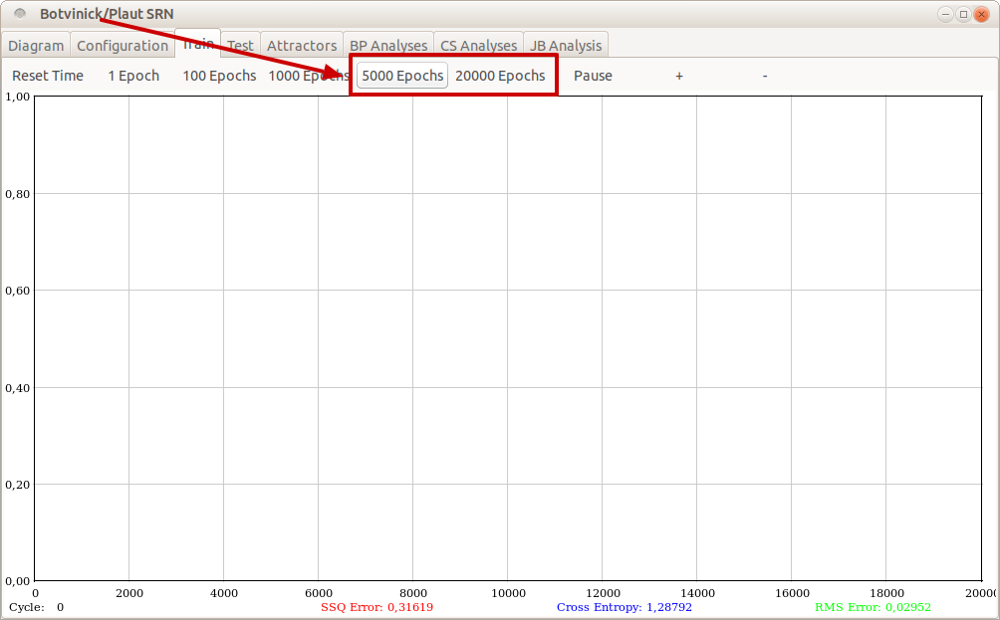
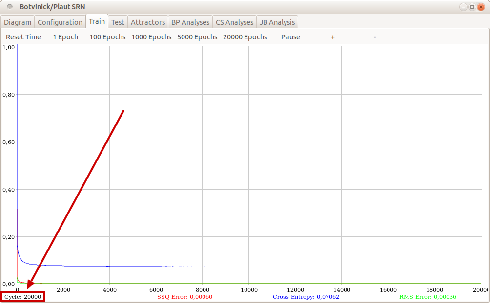
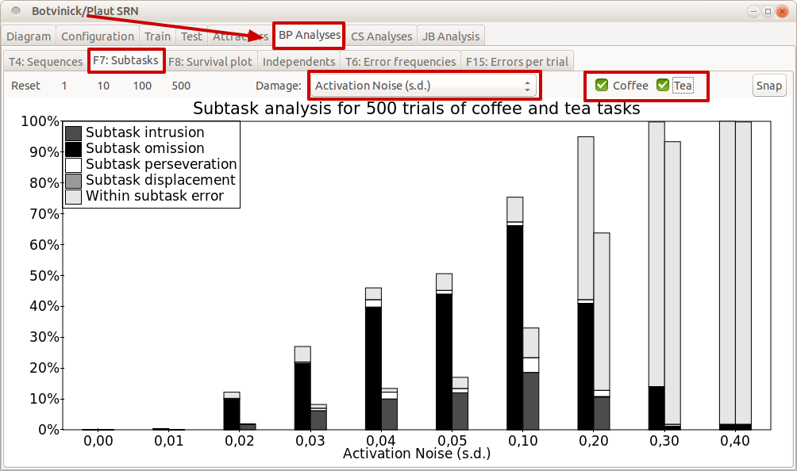

# Botvinick and Plaut (2004)
This is an implementation of the Botvinick and Plaut (2004) SRN model of routine
action selection and its disorders.

Botvinick, M., & Plaut, D. C. (2004). Doing Without Schema Hierarchies: A Recurrent Connectionist Approach to Normal and Impaired Routine Sequential Action. *Psychological Review*, 111(2), 395–429. https://doi.org/10.1037/0033-295X.111.2.395


## Installation
To run the model it first needs to be compiled (once) using
[gcc](https://gcc.gnu.org):
```bash
make all
```

## Run
Then, run the command below to launch the GUI:
```bash
./xbp
```

## GUI
To explore the model's behaviour it first needs to be trained. Open the "Train"
tab and train it for at least 5000 epochs (but ideally 20,000, as in the
original work). See screenshots below that highlight in red what to take notice of and where to click.





Then explore the model's response to damage by, for example,
switching to the "BP Analyses" tab and selecting one of those analyses. Each of
these analyses takes the currently trained network and explores its behaviour
according to one of the analyses from the original (i.e., 2004) publication, or
with alternative forms of damage.


