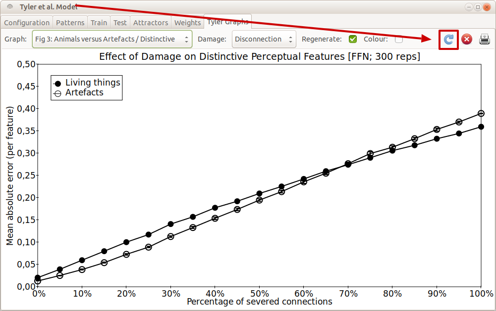

# Tyler et al. (2000)
This code is an implementation of the Tyler et al. (2000) model of the
organisation of semantic memory. The critical feature (for Tyler et al.) is the
correlational structure of features in the different domains.

> Tyler, L. K., Moss, H. E., Durrant-Peatfield, M. R., & Levy, J. P. (2000).
> Conceptual structure and the structure of concepts: A distributed account of
> category-specific deficits. *Brain and language*, 75(2), 195-231.
> https://doi.org/10.1006/brln.2000.2353


The code provides a faithful reimplementation of the original model (a simple feedforward autoassociator) as well as a recurrent implementation (in which the hidden layer is augmented with recurrent connections). Both models show the same sensitivity to the structure of the patterns.


## To run
To run the model it first needs to be compiled (once) using [gcc](https://gcc.gnu.org):
```
make all
```

Then, run the command below to launch the GUI:
```
./xtyler
```

## GUI

To generate the graphs used in the paper, switch to the "Tyler Graphs" tab and click the "Refresh" button (third from right). The simulation will run 300 networks, redrawing after each network.




The recurrent network is trained with BPTT in one of two modes. If compiled with
the ```CLAMPED``` flag ```#defined```, then the input is clamped for 10 cycles
while the network settles. (10 cycles appears to be enough to allow this.) If
the ```CLAMPED``` flag is not ```#defined```, then the input is clamped for the
first cycles and then set to zero. This is an odd configuration. (For example,
in the Rogers model, recurrent connections from hub back to the input layer mean
that the input is reconstructed and feed back, and hopefully this means that
when clamps are removed in the hub model the input units don't change. In this
set up, the network has to learn to use the input from the first 4 cycles to get
near the attractor, and then to ignore the input (which will be zero). This
makes the net an odd cross between the Botvinick/Plaut settling net and the hub
network.)  BPTT requires that the learning rate be less (partly because you
effectively have multiple layers contributing to the sum that makes up delta, so
you need to scale back the learning rate in proportion to the number of
cycles/layers).

On the "Lesion Results" page, when "Regenerate" is off the current state of the
network is used to generate results, rather than training to criterion each
time. If the current state has not been trained, and "Regenerate" is off, you'll
end up with very high absolute errors — and possible apparently blank graphs.
